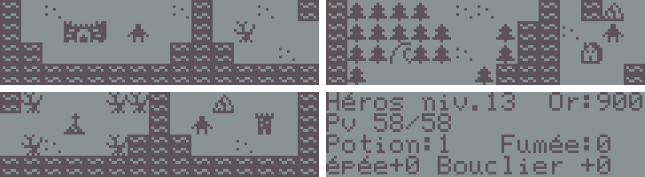

# Canon X-07 Quest




## 🇫🇷 Français

### Présentation
`Canon X-07 Quest` est un mini-RPG en assembleur Z80 pour l’ordinateur de poche Canon X-07.

Le joueur incarne un héros envoyé par le roi pour retrouver un sorcier en fuite. L’aventure commence près du château, puis traverse le cimetière, la forêt, les ruines, l’oasis et enfin la tour noire.

Le jeu propose une musique monophonique, une carte de 30x16 cases à explorer, 7 types d’ennemis différents, 7 lieux à visiter et environ une bonne heure de jeu.

Le jeu a été réalisé dans le cadre de la Game Jam Retro Programmers United for Obscure Systems, session Canon X-07 de 2026 :
[https://itch.io/jam/rpufos-canon-x07](https://itch.io/jam/rpufos-canon-x07)

Le projet a été développé avec l’aide de ChatGPT 5.4.

### Matériel requis
Une puce d’extension RAM de 8 ko est obligatoire.

Modèles testés :
- `Toshiba TC5565PL-15`
- `Toshiba TC5565APL-10L`
- ou tout équivalent compatible

### Chargement
Le jeu doit être chargé à l’adresse mémoire :

```text
$2000
```

Le chargement par liaison série est recommandé avec ce projet :
[Canon X-07 Serial Fast Loader](https://github.com/pR-0000/Canon-X-07-Serial-Fast-Loader)

Configuration recommandée :
- charger le loader à l’adresse `$1F00`
- charger ensuite `quest_FR.bin` ou `quest_EN.bin` à l’adresse `$2000`

### Compilation
Le fichier source principal est `quest.z80`.

Assemblage recommandé avec `sjasmplus` :

```bash
sjasmplus --raw=quest_FR.bin quest.z80
```

Pour une version anglaise, régler `BUILD_LANG_EN equ 1` dans `quest.z80`, puis assembler par exemple :

```bash
sjasmplus --raw=quest_EN.bin quest.z80
```

### Commandes
- Flèches directionnelles : déplacer le héros et déplacer le curseur dans les menus
- `F6` : valider
- `DEL` : annuler
- Clavier `QWERTY` : saisir les mots pendant les combats
- `BREAK` : quitter le jeu et revenir au BASIC lorsque le joueur se trouve sur la carte

### Histoire
Le roi charge le héros de poursuivre un sorcier qui a fui le royaume. Pour le retrouver, il faudra explorer plusieurs régions, vaincre les gardiens qui protègent sa fuite et progresser jusqu’à la tour noire où se déroule l’affrontement final.

### Système de combat
Les combats sont aléatoires sur la carte, à l’exception des boss.

Lors d’une attaque, un défi de frappe apparaît. Le joueur doit retaper rapidement le mot affiché pour obtenir un bonus de dégâts :
- réussite normale : petit bonus
- réussite rapide : bonus plus fort
- échec : aucun bonus

Le jeu mélange donc progression RPG, équipement et rapidité de frappe.

### Remarque sur l’affichage
Certains Canon X-07 sont connus pour avoir un affichage légèrement plus lent que d’autres. Dans ce cas, le contrôleur LCD T6834 peut parfois interférer avec certaines écritures graphiques très rapides, ce qui provoque quelques glitchs visuels ponctuels ou des octets d’écran mal copiés.

Ces artefacts restent rares, n’affectent pas la sauvegarde, et n’ont normalement pas de conséquence sur le gameplay.

### Sauvegarde
La progression est sauvegardée automatiquement pendant l’aventure.

Si vous souhaitez recommencer une partie totalement neuve, le plus simple est de recharger proprement le programme et de repartir sans ancienne sauvegarde.

---

## 🇬🇧 English

### Overview
`Canon X-07 Quest` is a small Z80 assembly RPG for the Canon X-07 pocket computer.

You play a hero sent by the king to track down a fleeing sorcerer. The adventure begins near the castle, then continues through the graveyard, the forest, the ruins, the oasis, and finally the black tower.

The game features monophonic music, a 30x16-tile world map to explore, 7 enemy types, 7 places to visit, and roughly one good hour of playtime.

The game was created for the Retro Programmers United for Obscure Systems Game Jam, Canon X-07 2026 session:
[https://itch.io/jam/rpufos-canon-x07](https://itch.io/jam/rpufos-canon-x07)

The project was developed with the help of ChatGPT 5.4.

### Hardware Requirements
An 8 KB RAM expansion chip is mandatory.

Tested models:
- `Toshiba TC5565PL-15`
- `Toshiba TC5565APL-10L`
- or any compatible equivalent

### Loading
The game must be loaded at:

```text
$2000
```

Serial loading is recommended with this project:
[Canon X-07 Serial Fast Loader](https://github.com/pR-0000/Canon-X-07-Serial-Fast-Loader)

Recommended setup:
- load the loader at `$1F00`
- then load `quest_FR.bin` or `quest_EN.bin` at `$2000`

### Build
The main source file is `quest.z80`.

Recommended assembly command with `sjasmplus`:

```bash
sjasmplus --raw=quest_FR.bin quest.z80
```

For an English build, set `BUILD_LANG_EN equ 1` in `quest.z80`, then assemble for example:

```bash
sjasmplus --raw=quest_EN.bin quest.z80
```

### Controls
- Direction keys: move the hero and move the cursor in menus
- `F6`: confirm
- `DEL`: cancel
- `QWERTY` keyboard: type words during battles
- `BREAK`: quit the game and return to BASIC while the player is on the world map

### Story
The king sends the hero after a sorcerer who has fled the kingdom. To catch him, the player must explore several regions, defeat the guardians along his path, and eventually reach the black tower for the final battle.

### Battle System
Battles are random on the world map, except for bosses.

During an attack, a typing challenge appears. The player must quickly type the displayed word to gain a damage bonus:
- normal success: small bonus
- fast success: stronger bonus
- failure: no bonus

The game is built around a mix of RPG progression, equipment upgrades, and typing speed.

### Display Note
Some Canon X-07 units are known to refresh the display a little more slowly than others. When this happens, the T6834 LCD controller can occasionally interfere with very fast graphic writes, which may result in minor visual glitches or a few display bytes being copied incorrectly.

These glitches are only visual, do not affect saves, and should not impact gameplay.

### Save System
Progress is saved automatically during the adventure.

If you want to start a completely fresh run, the simplest method is to reload the program cleanly and begin again without using an old save.
